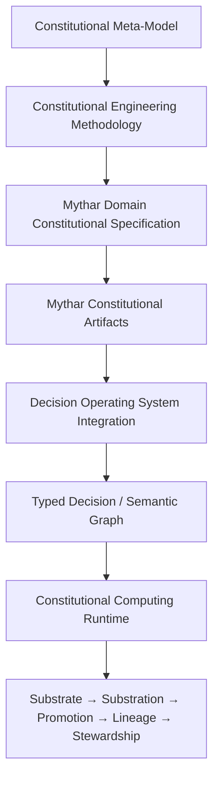

# Mythar CEM–DOS Integration Profile v0.1

**Status:** Specified integration profile  
**Evidence classification:** Specified  
**Scope:** A formal mapping of Mythar artifacts to the supplied Constitutional Engineering Methodology (CEM) and Decision Operating System (DOS) concepts.

## Constitutional position and boundary

Mythar DCS is mapped here as a CEM-aligned Domain Constitutional Specification for the Mythar language, semantic engine, registry, and conformance domains. This profile does **not** make CEM, DOS, CMM, CSS, CCS, CCR, or AAES-OS external runtime dependencies, and does not claim that those external specifications have been independently ratified in this repository.

## Artifact mapping

| CEM artifact type | Mythar governing artifact |
| --- | --- |
| Principles | Mythar DCS constitutional position and invariants |
| Specifications | Semantic Engine Specification; Grammar Standard; ISF specification |
| Architectures | Reference architectures such as RA-MYTHAR-001 |
| Implementations | `mythar-v0.2/`, API, SDKs, and transducers |
| Evidence | Constitutional Registry, ratification records, release manifests |
| Conformance | Versioned conformance corpora and reproducible reports |
| Stewardship | Release Standard, amendment process, and registry governance |

## Invariant mapping

| CEM invariant | Mythar realization |
| --- | --- |
| I1 — Declared intent | Required traceability across CRS, CAIP, DCS, registry, conformance, assurance, and release |
| I2 — Evidence attached | Observed / Specified / Hypothesized classification; registries, diagnostics, and reports |
| I3 — Continuity proven | Versioned registry lineage, release tags, migration and amendment rules |
| I4 — Conformance verified | Executable v0.2, v0.3, and ISF v0.4 conformance suites |

## DOS integration contract

DOS MAY consume Mythar compile results as typed decision/semantic objects:

- **Nodes:** AST roots, composites, particles, and operator applications.
- **Edges:** parsing, canonicalization, invariant enforcement, and registry-reference attachment.
- **Evidence:** diagnostics, invariant outcomes, registry references, ISF context, and conformance reports.
- **Narrative projection:** ISF-to-language transduction is a projection over canonical semantic state; it is not canonical state itself.

The Mythar engine therefore supplies deterministic, registry-backed semantic transformations suitable for a DOS-compatible substrate without requiring a DOS implementation.

## SemanticRegistryArtifact profile

The target constitutional artifact class has these required concerns: registry version; lexeme entries; entry-level ratification references; invariant bindings; lineage/migration links; and conformance references. The companion schema defines the target envelope. Existing v0.1–v0.3 registry files remain historical registry formats; migration to the full envelope requires a separately ratified registry version.

## Lineage model

## Adoption and assurance

This profile is implementation-independent. A future CEM, DOS, or AAES-OS release may cite it using stable clause identifiers; until then, this document is the repository-local specified mapping. Changes require traceability, conformance impact assessment, and a new profile version.
