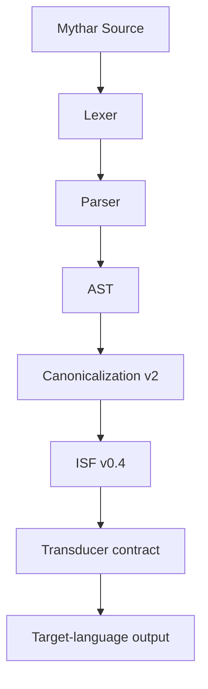

# Mythar v0.4 — Constitutional Semantic Pipeline

**Status:** Draft for ratification  
**Version:** 0.4  
**Purpose:** Define the governed pipeline from Mythar source through AST and ISF to a target-language transducer.

## Pipeline overview

```text
Mythar Source
      ↓
[Lexer + Parser]
      ↓
AST (Mythar)
      ↓
[Canonicalization: registry + compiler invariants]
      ↓
ISF v0.4 (Intermediate Semantic Form)
      ↓
[Transduction Contract]
      ↓
Target Language Output
```

## Stages

1. **Lexing and parsing** tokenizes roots and operators, constructs an AST, and reports malformed expressions.
2. **Canonicalization** applies the active versioned registry, preserves API v1/v2 compatibility, and reports conformance diagnostics.
3. **ISF generation** converts a valid AST to root, class, domain, intent, operators, arguments, context, and metadata. ISF is the semantic evidence consumed downstream.
4. **Transduction** maps ISF to English, Spanish, Gaulish, glyphs, or another target through a versioned contract. It does not add compiler semantics.



## Versioning and governance

- Compiler API v2 emits draft ISF v0.4; API v1 retains its legacy canonical output.
- The v0.3 registry and v0.2 conformance contract remain preserved.
- ISF v0.4 is a draft for ratification, not a claim of historical reconstruction.
- CRS v1.0 may bind canonical roots; CAIP v1.0 may bind operator inheritance; a later ISF version may add lineage metadata.
- Target-language contracts are independently versioned and must state their evidence classification. Reconstructed-language mappings are Hypothesized until independently evidenced.
